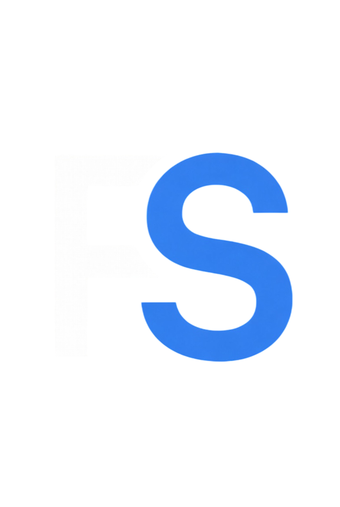
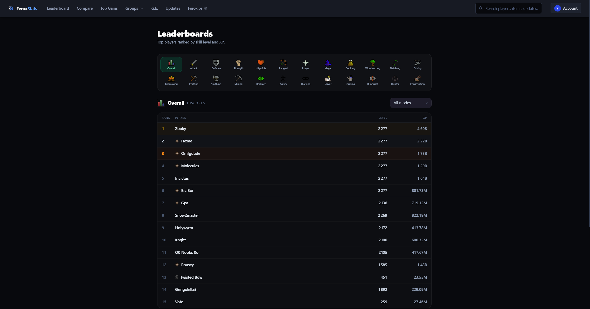
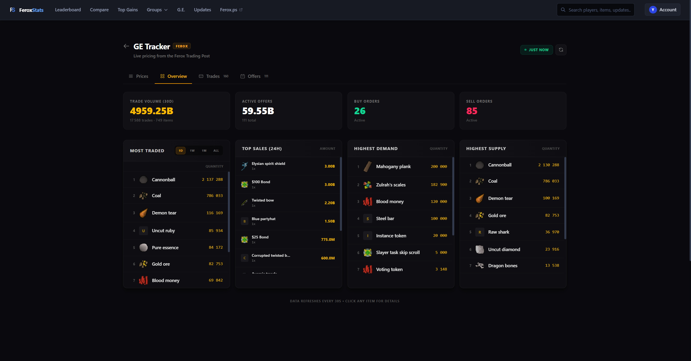
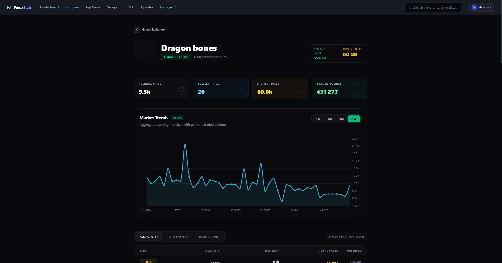
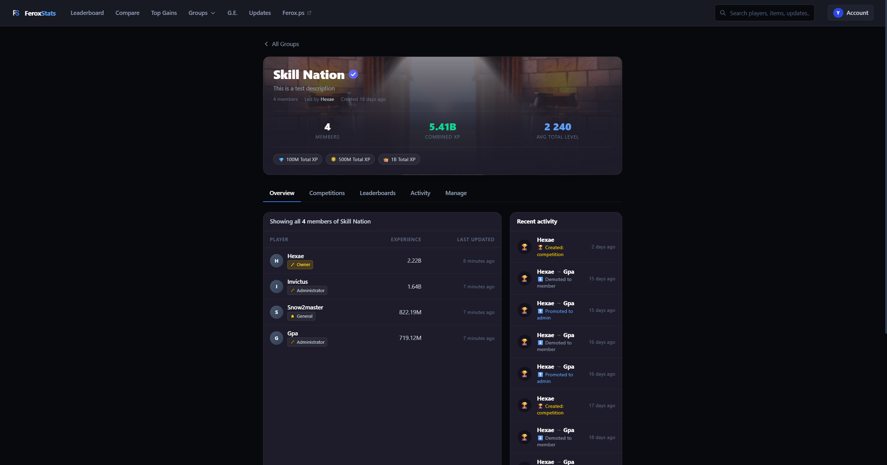
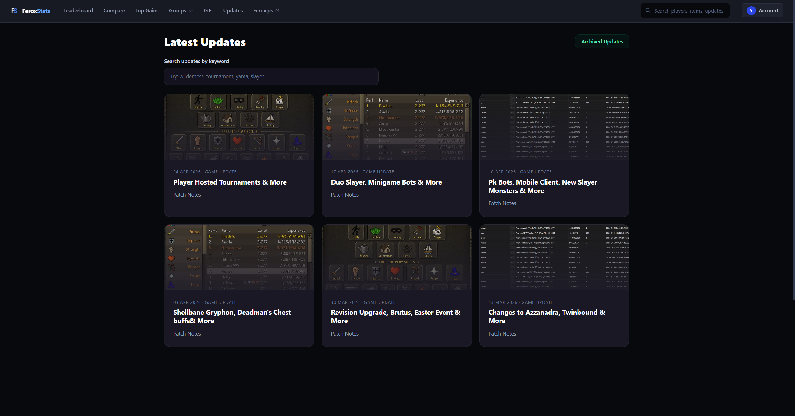

The open-source stats and analytics platform for the Ferox.ps OSRS private server.

FeroxStats tracks player progress, group events, Grand Exchange activity, competitions, and more — built for the [Ferox.ps](https://ferox.ps) Old School RuneScape private server.

[Website](https://www.feroxstats.com/) | [Discord](#) | [API Docs](https://www.feroxstats.com/api-docs)

 

> This project is not affiliated with Jagex Ltd or the official Old School RuneScape game.

## Project structure and stack

The repository is divided into two components:

- **App**: (The web app & API)
  - Next.js 16 (App Router)
  - React 19 + Tailwind CSS v4
  - Supabase (Postgres + Auth + RLS)
  - Chart.js + SWR

- **Bot**: (The Discord notifier)
  - Node.js + TypeScript
  - Supabase JS

 

## API

FeroxStats exposes a REST API used by the web app and bot. Interactive documentation is available at `/api-docs` on any running instance.

 

## Suggestions and bugs

Have a suggestion or a bug to report? [Click here to create an issue](https://github.com/your-org/feroxstats/issues)

Have something else you'd like to discuss? [Join us on Discord](#)

 

## Screenshots

### Leaderboard

### GE analytics (overview)

### GE analytics (item detail)

### Groups

### Updates

 

## Contributing

Check the development guides below to get started:

**Help expand and improve the FeroxStats web app:** [App Development Guide](.github/contributing/app-guide.md)

**Help expand and improve the FeroxStats Discord bot:** [Bot Development Guide](.github/contributing/bot-guide.md)

 

## License

[MIT](LICENSE)
